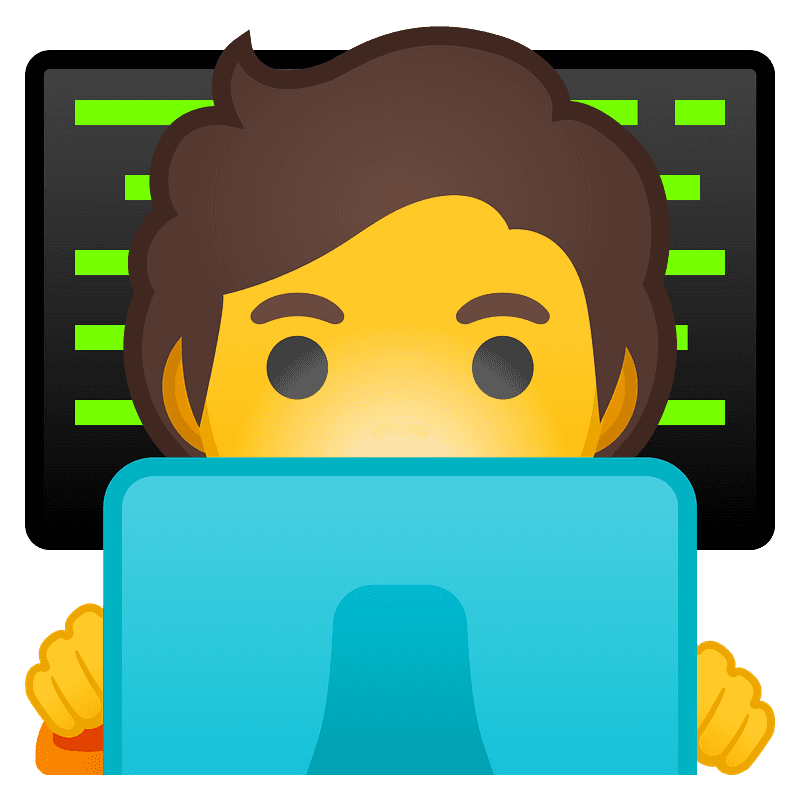

 
<h1>
  hey there, I'm Osmar
  
   
  

  
  
</h1>

  ### :man: About me
  
  - :computer: I enjoy working on frontend and backend web applications.
  - :seedling: I currently learning how to work with docker :whale:
  - 👯 I’m looking to collaborate on open source projects!
  
  #
  
  ### :hammer_and_wrench: Tech skills
  
  

    
    
    
    
     
    
    
    
    
    
  

  

<!--
**osmfaria/osmfaria** is a ✨ _special_ ✨ repository because its `README.md` (this file) appears on your GitHub profile.

Here are some ideas to get you started:

- 🔭 I’m currently working on ...
- 🌱 I’m currently learning ...
- 👯 I’m looking to collaborate on ...
- 🤔 I’m looking for help with ...
- 💬 Ask me about ...
- 📫 How to reach me: ...
- 😄 Pronouns: ...
- ⚡ Fun fact: ...
-->
